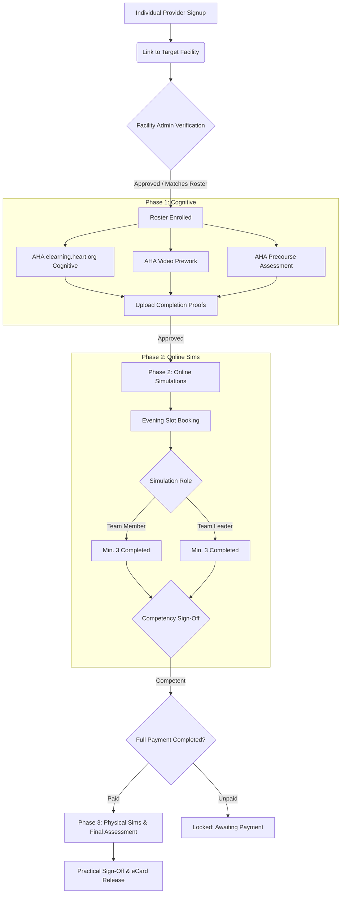

# Multi-Institutional Cohort ACLS/BLS Program Integration Plan

This document details the technical architecture, database schema changes, API routes, and algorithms required to support the multi-institutional, subsidized 6-month Intern ACLS & BLS Training Program. It coordinates individual provider dashboards with institutional aggregate reporting, and manages flexible individual payment schedules and prioritised Phase 2 waitlists across multiple facilities.

---

## 1. Program Blueprint & Core Logic



---

## 2. Database Schema Extensions

To support cohort categorization, individual flexible payment ledgers, and simulation booking roles, the following schema updates are proposed for `drizzle/schema.ts`:

### 2.1 Cohort & Designation Updates
We extend the enum and add a custom designation field to track the specific intern types at any facility:
- **NOI** (Nursing Officer Intern, BSN-holding)
- **Clinical Officer Intern (BSc)**
- **Diploma COI**
- **MOI** (Medical Officer Intern / Doctor)
- **Permanent Staff Nurse**
- **Permanent Doctor**

```typescript
// Extends the institutionalStaffMembers and providerProfiles tables
export const designationEnum = mysqlEnum("designation", [
  "noi",
  "coi_bsc",
  "coi_diploma",
  "moi",
  "permanent_nurse",
  "permanent_doctor",
  "other"
]);

// Modify institutionalStaffMembers to add:
// designation: designationEnum
// totalPaidAmount: decimal("totalPaidAmount", { precision: 10, scale: 2 }).default("0.00")
// phaseStatus: mysqlEnum("phaseStatus", ["phase_1", "phase_2", "phase_3", "completed"]).default("phase_1")
// facilityLinkStatus: mysqlEnum("facilityLinkStatus", ["pending", "linked", "rejected"]).default("pending")
```

### 2.2 Payment Installment Tracking
Individual interns pay at their own free time (aligned with stipend release schedules). We track this via an individual payments ledger linked to the enrollment.

```typescript
export const individualInstallmentPayments = mysqlTable("individualInstallmentPayments", {
  id: int("id").autoincrement().primaryKey(),
  userId: int("userId").notNull(),
  enrollmentId: int("enrollmentId").notNull(),
  amount: decimal("amount", { precision: 10, scale: 2 }).notNull(),
  paymentDate: timestamp("paymentDate").defaultNow().notNull(),
  mpesaReceiptNumber: varchar("mpesaReceiptNumber", { length: 50 }).unique().notNull(),
  phoneNumber: varchar("phoneNumber", { length: 20 }).notNull(),
  status: mysqlEnum("status", ["pending", "completed", "failed"]).default("pending"),
});
```

### 2.3 Role-based Simulation Bookings
Phase 2 simulations require tracking booking roles (`team_member` vs `team_leader`) to ensure the min 3/3 rule is monitored.

```typescript
// Add enum to trainingAttendance
export const simulationRoleEnum = mysqlEnum("simulationRole", ["team_member", "team_leader"]);

// Add fields to trainingAttendance:
// simulationRole: simulationRoleEnum
// simulationCompetencyPassed: boolean("simulationCompetencyPassed").default(false)
```

---

## 3. API & Router Integrations (tRPC)

We introduce new endpoints in `server/routers/institution.ts` and `server/routers/courses.ts` to manage the program:

### 3.1 Cohort Aggregation Router (Institution)
Allows Facility Admin to view aggregate progress by designation cohorts.

```typescript
getCohortProgress: protectedProcedure
  .input(z.object({ institutionId: z.number() }))
  .query(async ({ input, ctx }) => {
    const db = await getDb();
    await assertInstitutionAccess(db, ctx.user, input.institutionId);

    const cohortStats = await db
      .select({
        designation: institutionalStaffMembers.designation,
        totalCount: sql<number>`count(${institutionalStaffMembers.id})`,
        blsCompleteCount: sql<number>`sum(case when ${institutionalStaffMembers.certificationStatus} = 'certified' and ${institutionalStaffMembers.assignedCourses} like '%bls%' then 1 else 0 end)`,
        aclsCompleteCount: sql<number>`sum(case when ${institutionalStaffMembers.certificationStatus} = 'certified' and ${institutionalStaffMembers.assignedCourses} like '%acls%' then 1 else 0 end)`,
        phase2CompleteCount: sql<number>`sum(case when ${institutionalStaffMembers.phaseStatus} in ('phase_3', 'completed') then 1 else 0 end)`
      })
      .from(institutionalStaffMembers)
      .where(eq(institutionalStaffMembers.institutionalAccountId, input.institutionId))
      .groupBy(institutionalStaffMembers.designation);

    return cohortStats;
  })
```

### 3.2 Individual Payment Gateway & Balance Router
Manages self-funded learner payment installments.

```typescript
getIndividualBalance: protectedProcedure
  .input(z.object({ enrollmentId: z.number() }))
  .query(async ({ input, ctx }) => {
    const db = await getDb();
    const [paymentsSum] = await db
      .select({ total: sum(individualInstallmentPayments.amount) })
      .from(individualInstallmentPayments)
      .where(and(
        eq(individualInstallmentPayments.userId, ctx.user.id),
        eq(individualInstallmentPayments.enrollmentId, input.enrollmentId),
        eq(individualInstallmentPayments.status, "completed")
      ));
    
    // Fetch course base/subsidized price dynamically from courses table
    const [course] = await db
      .select({ price: courses.price })
      .from(courses)
      .innerJoin(enrollments, eq(enrollments.courseId, courses.id))
      .where(eq(enrollments.id, input.enrollmentId))
      .limit(1);

    const basePrice = Number(course?.price ?? 20000.00);
    const totalPaid = Number(paymentsSum?.total ?? 0);
    const balance = basePrice - totalPaid;
    const isPaidInFull = balance <= 0;

    return { totalPaid, balance, isPaidInFull };
  })
```

---

## 4. Prioritised Waitlist Scheduling Algorithm

**Rule:** Prioritise learners who have paid the most, while keeping slots distributed so unpaid learners still get a chance to complete Phase 2 (since they will pay in full before Phase 3).

### Algorithm Design (Weighted Lottery Selector)

We assign a **Waitlist Weight** to each booking request:
- **Tier 1 (Paid >= 75%)**: Weight = 4
- **Tier 2 (Paid 25% - 74%)**: Weight = 2
- **Tier 3 (Paid < 25%)**: Weight = 1

When simulation slots are allocated, we reserve:
- **60% of slots** for direct weight-prioritized selection (High-payers first).
- **40% of slots** to be selected via a weighted lottery or first-come, first-served (FCFS) among all pending waitlist members. This guarantees that even a learner with 0% paid has a baseline probability of booking a simulation, preventing total starvation of stipend-delayed interns.

```typescript
interface WaitlistCandidate {
  userId: number;
  amountPaid: number;
  waitlistEntryTime: Date;
}

export function sortAndPrioritizeWaitlist(
  candidates: WaitlistCandidate[],
  availableSlots: number,
  baseFee: number
): number[] {
  // 1. Calculate weight for each candidate
  const candidatesWithWeight = candidates.map(c => {
    const paidPct = c.amountPaid / baseFee;
    let weight = 1;
    if (paidPct >= 0.75) weight = 4;
    else if (paidPct >= 0.25) weight = 2;

    return { ...c, weight };
  });

  // 2. Allocate 60% of slots to the highest paying candidates
  const prioritizedSlotsCount = Math.floor(availableSlots * 0.60);
  const regularSlotsCount = availableSlots - prioritizedSlotsCount;

  candidatesWithWeight.sort((a, b) => {
    if (b.weight !== a.weight) return b.weight - a.weight;
    return a.waitlistEntryTime.getTime() - b.waitlistEntryTime.getTime();
  });

  const selectedUserIds: number[] = [];
  const allocatedSet = new Set<number>();

  for (let i = 0; i < Math.min(prioritizedSlotsCount, candidatesWithWeight.length); i++) {
    const candidate = candidatesWithWeight[i];
    selectedUserIds.push(candidate.userId);
    allocatedSet.add(candidate.userId);
  }

  // 3. Fill the remaining 40% of slots with first-come first-served from the unselected pool
  const remainingCandidates = candidatesWithWeight.filter(c => !allocatedSet.has(c.userId));
  remainingCandidates.sort((a, b) => a.waitlistEntryTime.getTime() - b.waitlistEntryTime.getTime());

  for (let i = 0; i < Math.min(regularSlotsCount, remainingCandidates.length); i++) {
    selectedUserIds.push(remainingCandidates[i].userId);
  }

  return selectedUserIds;
}
```

---

## 5. Security & Verification Gates

1. **Self-Linking Security Gate**:
   - Providers register individually and pick their target facility.
   - Their profile state is set to `facilityLinkStatus = 'pending'`.
   - On the Facility Admin Portal, a new **"Pending Approvals"** tab displays all providers claiming to be interns/staff.
   - The facility admin must approve them. Once approved, the provider's data is aggregated, and they gain access to the institutional dashboard.
2. **Phase 1 -> Phase 2 Transition Gate**:
   - Cognitive prework proofs (`elearning.heart.org` certificates) must be uploaded via an upload widget.
   - These are queued for coordinators to verify.
   - Booking for online simulations is disabled until `phaseStatus` is advanced to `phase_2`.
3. **Phase 2 -> Phase 3 Transition Gate**:
   - Booking for Phase 3 physical sessions is gated by both:
     1. Simulation Competency Sign-Off (`phaseStatus` marked `phase_3` by Phase 2 instructors).
     2. Individual account balance = 0 KES (Full course fee paid).
