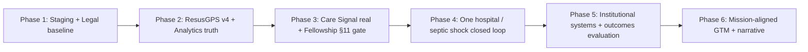

# Paeds Resus — Platform Maturity Roadmap

**Document type:** CEO-ready strategic execution roadmap  
**Version:** 1.0  
**Date:** 2026-05-25  
**Status:** Active — execution sequencing companion to [PLATFORM_SOURCE_OF_TRUTH.md](./PLATFORM_SOURCE_OF_TRUTH.md) (PSOT) §12 priorities and [STRATEGIC_FOUNDATION.md](./STRATEGIC_FOUNDATION.md) success criteria  
**Audience:** CEO, engineering, clinical governance, institutional sales, product

**Purpose:** Close the ten objective gaps identified in the May 2026 platform maturity assessment and deliver a **mature product** that can fulfill Paeds Resus's mandate: reduce preventable childhood death and harm in resource-limited settings through an **integrated**, **honest**, **governed** platform—not a collection of partially connected features.

**Canonical references (do not duplicate definitions here):**

| Topic | Canonical doc |
|-------|----------------|
| Product/auth/metrics decisions | [PLATFORM_SOURCE_OF_TRUTH.md](./PLATFORM_SOURCE_OF_TRUTH.md) |
| Mission, theory of change, honest claims | [STRATEGIC_FOUNDATION.md](./STRATEGIC_FOUNDATION.md) |
| Fellowship rules & §11 launch gate | [FELLOWSHIP_QUALIFICATION_AND_PROVIDER_INTELLIGENCE.md](./FELLOWSHIP_QUALIFICATION_AND_PROVIDER_INTELLIGENCE.md) |
| Care Signal implementation detail | [CARE_SIGNAL_STRATEGY_AND_ROADMAP.md](./CARE_SIGNAL_STRATEGY_AND_ROADMAP.md) |
| Provider growth KPIs (distinct from clinical outcomes) | [CONVERSION_90_DAY_EXECUTION_PLAN.md](./CONVERSION_90_DAY_EXECUTION_PLAN.md) |
| Engineering priority sequencing | [FIVE_PILLAR_EXECUTION_ROADMAP.md](./FIVE_PILLAR_EXECUTION_ROADMAP.md) |
| Staging/release discipline | [STAGING_BRANCH_SETUP.md](./STAGING_BRANCH_SETUP.md), [STAGING_DEPLOYMENT.md](./STAGING_DEPLOYMENT.md) |
| Scrum board | [BACKLOG_BOARD.md](./BACKLOG_BOARD.md) |
| Weekly execution log | [WORK_STATUS.md](./WORK_STATUS.md) |

---

## Executive summary

### Mission link

Paeds Resus exists to reduce **preventable childhood mortality and serious harm** in **low-resource settings** by improving recognition, sequence of actions, professional competence, institutional systems, and feedback loops—not by selling certifications or bedside apps in isolation ([STRATEGIC_FOUNDATION.md](./STRATEGIC_FOUNDATION.md) §2–3; PSOT §19).

### Current state (May 2026)

The platform has **substantial surface area**: ResusGPS bedside guidance, micro-courses (Septic Shock I live), M-Pesa payments, Care Signal submission, fellowship progress UI, institutional portal scaffolding, and admin analytics. However, an objective gap analysis identified **ten structural blockers** that prevent the product from fulfilling its mandate:

| # | Blocker | Severity |
|---|---------|----------|
| 1 | Holistic loop not closed (ResusGPS → Care Signal → learning → institutional action) | Critical |
| 2 | Fellowship shipped ahead of [§11 launch gate](./FELLOWSHIP_QUALIFICATION_AND_PROVIDER_INTELLIGENCE.md) | Critical |
| 3 | No pathway to provable clinical outcomes | Critical |
| 4 | Single production, no live staging | High |
| 5 | Market/growth model misaligned with mission economics | High |
| 6 | Care Signal intelligence layer immature | High |
| 7 | ResusGPS v4 incomplete | High |
| 8 | Legal/compliance/clinical governance gates open | High |
| 9 | Product narrative fragmentation (Bronze/Silver/Gold, aspirational DNA, etc.) | Medium |
| 10 | Institutional value prop built for "seats" vs "systems" | High |

**Honest assessment:** We have built **parts of every lever** but not **one complete proof** that the theory of change works end-to-end. That is the maturity gap.

### Target mature state (18-month horizon)

A **mature Paeds Resus** means:

1. **One verified vertical slice** — one partner hospital, one clinical condition (Paediatric Septic Shock), one **closed loop**: ResusGPS case → Care Signal reflection → linked micro-course → institutional gap visibility → documented action.
2. **Fellowship integrity** — "Paeds Resus Fellow" title and progress UI live **only after** [§11 checklist](./FELLOWSHIP_QUALIFICATION_AND_PROVIDER_INTELLIGENCE.md) passes; until then, learners see honest "in progress" language without premature credentialing.
3. **Provable process outcomes** — time-to-fluid, time-to-antibiotic, Care Signal reporting rate, ResusGPS adoption by facility—not mortality claims we cannot yet defend ([STRATEGIC_FOUNDATION.md](./STRATEGIC_FOUNDATION.md) §12).
4. **Release discipline** — live staging URL, `develop` → staging → `main` → production, migrations tested before production (PSOT §10, §12 #2).
5. **Mission-aligned economics** — individual lane optimises ResusGPS + micro-courses; institutional lane sells **readiness systems**, not PALS seat bundles (PSOT §15.3).
6. **Unified narrative** — one product language: Paeds Resus platform, ResusGPS product, Care Signal product, Paeds Resus Fellowship pathway (not Bronze/Silver/Gold tiers or "System DNA" marketing in user-facing copy).
7. **Governed claims** — privacy, consent, retention, and clinical evaluation framework signed off before any public outcome or accreditation claims.

### Timeline overview

| Phase | Name | Duration | Cumulative |
|-------|------|----------|------------|
| **1** | Release & governance foundation | 6–8 weeks | Month 2 |
| **2** | ResusGPS v4 + instrumentation completion | 6–8 weeks | Month 4 |
| **3** | Care Signal truth + fellowship §11 gate | 8–10 weeks | Month 6 |
| **4** | Vertical slice — one hospital, one condition, one loop | 10–12 weeks | Month 9 |
| **5** | Institutional systems pilot + outcomes pathway | 10–12 weeks | Month 12 |
| **6** | Mission-aligned growth & narrative maturity | 12+ weeks (ongoing) | Month 15–18 |

**Total estimate:** 15–18 months to mature product with one publishable institutional proof; Fellowship **24-month discipline clock** for individual Fellows remains honest and unchanged—we do not promise Fellow completion in Phase 1.

---

## Maturity definition

"Mature product that delivers mandate" is measurable against PSOT §18–§19 and [STRATEGIC_FOUNDATION.md](./STRATEGIC_FOUNDATION.md) §12–§14.

### Must be true at maturity

| Dimension | Measurable criterion | Source alignment |
|-----------|---------------------|------------------|
| **Bedside usefulness** | ≥70% of ResusGPS sessions in pilot facility reach minimum depth threshold; undo/dedup/timers used without critical safety regressions | STRATEGIC_FOUNDATION §12.1; PSOT §12 #4 |
| **Closed learning loop** | ≥50% of Care Signal reports with knowledge/equipment gaps receive a platform-linked recommendation; ≥20% click-through to linked micro-course or ResusGPS pathway within 30 days | PSOT §19.4 |
| **Fellowship integrity** | 100% of Fellow titles issued via automated checks; §11 checklist fully green; zero manual conferral | FELLOWSHIP doc §4, §11 |
| **Care Signal intelligence** | Provider history, stats, gap analysis, and institutional facility view return **real DB data**; zero mock analytics pages | CARE_SIGNAL doc §5, §12 |
| **Release safety** | Staging URL live; 100% of auth/payment/migration PRs verified on staging before production for 8 consecutive weeks | PSOT §10; STAGING docs |
| **Honest outcomes** | One published process-outcome evaluation (pre/post or stepped-wedge design) for pilot hospital with clinical governance sign-off | STRATEGIC_FOUNDATION §12.4 |
| **Institutional value** | One signed institutional pilot measuring **system readiness** (reporting rate, gap closure, training coverage)—not seat count alone | PSOT §15.3 |
| **Governance** | Privacy policy, ToS, Care Signal consent, retention schedule, and appeals process reviewed and live | FELLOWSHIP doc §10 |
| **Narrative coherence** | Zero user-facing Bronze/Silver/Gold or aspirational "DNA" tier language; AGENTS.md brand rules pass audit | AGENTS.md §6 |
| **Analytics truth** | Admin reports match `analyticsEvents` rollups; Care Signal and Safe-Truth KPIs never combined | PSOT §8, §22.3 |

### Explicitly not required at 18 months (scope traps)

- National MOH contract or WHO recognition (PSOT §20.4 — aspirational pathway only)
- Full 24-slot micro-course catalog published
- Full Fellowship cohort graduated (24-month Pillar C clock)
- Mortality reduction claims without peer-reviewed evaluation
- Multi-country surveillance network at scale
- AI/autonomous clinical decision-making beyond governed, auditable prompts

---

## Phase map

### Phase 1 — Release & governance foundation

**Goal:** Make it safe to ship clinical and payment changes without gambling production; lock minimum legal and narrative guardrails so downstream work is not built on sand.

**Duration:** 6–8 weeks  
**Primary issues addressed:** #4, #8, #9 (partial)

| Workstream | Deliverables |
|------------|--------------|
| **Engineering** | Live Render staging service + Aiven staging DB; `develop` → staging auto/manual deploy; weekly staging smoke script; `SESSION_MAX_AGE_MS` locked in production env; admin audit log coverage list documented |
| **Product/Clinical** | Clinical Safety Register review for any in-flight pathway changes; scope disclaimer on ResusGPS entry maintained |
| **Legal/Ops** | Privacy policy + ToS update scoping Care Signal; layered consent wireframes; retention policy draft per table; appeals process outline for fellowship streak errors |
| **GTM/Institutional** | Narrative audit inventory: all pages mentioning Bronze/Silver/Gold, "DNA", lives-saved, or tier pricing; institutional landing copy draft pivoting to systems/readiness |

**Exit criteria**

- [ ] Staging URL documented in PSOT §10
- [ ] Two consecutive releases followed `feature → develop → staging → main` with checklist sign-off
- [ ] Security baseline phases A–C from [FIVE_PILLAR_EXECUTION_ROADMAP.md](./FIVE_PILLAR_EXECUTION_ROADMAP.md) complete
- [ ] Legal counsel engaged; consent/retention drafts in review
- [ ] Narrative audit spreadsheet complete with owner per page

**Dependencies:** None (critical path start)  
**Risks & mitigations**

| Risk | Mitigation |
|------|------------|
| Staging never provisioned (operator bandwidth) | CEO assigns single operator owner; block Phase 2 clinical merges until URL live |
| Legal review delays | Ship engineering gates first; gate **public outcome claims** separately from code releases |

**Owner suggestions:** CEO (legal sign-off), Engineering lead (staging), Clinical (safety register)

---

### Phase 2 — ResusGPS v4 + instrumentation completion

**Goal:** Complete PSOT §12 #4 bedside safety features and ensure every product emits truthful analytics before building intelligence layers on top.

**Duration:** 6–8 weeks  
**Primary issues addressed:** #7, #1 (partial), #4 (verification)

| Workstream | Deliverables |
|------------|--------------|
| **Engineering** | ResusGPS v4 remaining: countdown timers with reassessment prompts (per [RESUS_GPS_V4_FEATURES.md](./RESUS_GPS_V4_FEATURES.md)); medication dedup edge cases; multi-diagnosis polish; dose rationale coverage audit; `resus_*` + course + Care Signal events verified via `pnpm run verify:analytics` on staging |
| **Product/Clinical** | Septic Shock pathway clinical sign-off; timer UX tested with nurse persona (03:00 scenario) |
| **Legal/Ops** | PHI/sessionStorage rules unchanged; no new outcome claims in ResusGPS copy |
| **GTM/Institutional** | ResusGPS orientation copy in Septic Shock I course linking to `/resus` pathway (PSOT §16.5) |

**Exit criteria**

- [ ] All six ResusGPS v4 features marked complete in WORK_STATUS with test evidence
- [ ] Admin Reports ResusGPS rollup non-zero after staged test journeys
- [ ] No P0 clinical safety regressions in Clinical Safety Register
- [ ] Post-case export/summary available for vertical slice handoff (Phase 4)

**Dependencies:** Phase 1 staging live  
**Risks & mitigations**

| Risk | Mitigation |
|------|------------|
| Timer UX adds cognitive load | Feature-flag; default off until clinical review |
| Scope creep into new pathways | **One condition only** — Septic Shock; defer asthma/CSE pairs |

**Owner suggestions:** Engineering (v4), CEO/clinical advisor (pathway sign-off)

---

### Phase 3 — Care Signal truth + Fellowship §11 gate

**Goal:** Make Care Signal a real product (not a form into a void) and align Fellowship UI with automation reality per [§11 checklist](./FELLOWSHIP_QUALIFICATION_AND_PROVIDER_INTELLIGENCE.md).

**Duration:** 8–10 weeks  
**Primary issues addressed:** #2, #6, #1 (partial)

| Workstream | Deliverables |
|------------|--------------|
| **Engineering** | Care Signal Phase 1–2 from [CARE_SIGNAL_STRATEGY_AND_ROADMAP.md](./CARE_SIGNAL_STRATEGY_AND_ROADMAP.md): real `getEventHistory`, `getEventStats`, `getGapAnalysis`, dynamic recommendations; EAT month bucketing fix; single canonical form; mock data removed from `CareSignalAnalytics.tsx`; widget provenance labels; ResusGPS post-case → Care Signal prompt (PSOT §19.4 integration gap) |
| **Product/Clinical** | Fellowship progress UI: correct ≥1 / ≥3 catch-up copy; hide or relabel "Paeds Resus Fellow" badge until §11 green; single cumulative distance-to-Fellow dashboard |
| **Legal/Ops** | Care Signal consent at first submission; privacy policy publication; rate limiting + anti-gaming tests |
| **GTM/Institutional** | Internal QI one-pager for hospital partners explaining confidentiality model |

**Exit criteria**

- [ ] [FELLOWSHIP doc §11.1–11.3](./FELLOWSHIP_QUALIFICATION_AND_PROVIDER_INTELLIGENCE.md) all checkboxes pass
- [ ] [CARE_SIGNAL doc §12](./CARE_SIGNAL_STRATEGY_AND_ROADMAP.md) launch checklist pass
- [ ] Provider submitting test event sees history, gap chart, and streak update within 60 seconds
- [ ] No "Fellow" title shown unless automation proves eligibility

**Dependencies:** Phase 1 (legal drafts), Phase 2 (ResusGPS post-case hook)  
**Risks & mitigations**

| Risk | Mitigation |
|------|------------|
| Fellowship UI already public creates trust debt | Immediate interim: rename to "Fellowship pathway progress" without "Fellow" badge until gate passes |
| UTC/EAT bug causes streak disputes | Integration tests with EAT boundary timestamps; documented appeals path |

**Owner suggestions:** Engineering (Care Signal backend), Product (Fellowship UX), CEO (§11 sign-off)

---

### Phase 4 — Vertical slice: one hospital, one condition, one closed loop

**Goal:** Prove the theory of change in one real facility with Paediatric Septic Shock—the PSOT §16.7 execution focus—before scaling catalog or geography.

**Duration:** 10–12 weeks  
**Primary issues addressed:** #1, #3 (framework), #10 (pilot design)

| Workstream | Deliverables |
|------------|--------------|
| **Engineering** | Closed-loop triggers: ResusGPS septic shock case completion → Care Signal prompt → gap-based micro-course recommendation → institutional facility dashboard slice (Care Signal aggregates by `facilityId`); fellowship ResusGPS pillar depth rules for septic shock condition |
| **Product/Clinical** | Partner hospital MOU (single county referral facility); baseline process metrics defined: time-to-first-fluid, time-to-antibiotic (self-reported + Care Signal structured fields), ResusGPS session count, Care Signal reporting rate |
| **Legal/Ops** | Facility consent for aggregated QI data; B2B contract template emphasising **systems improvement** not seat resale |
| **GTM/Institutional** | Pilot playbook: 90-day hospital onboarding, champion nurse identification, monthly QI review cadence |

**Exit criteria**

- [ ] One hospital with ≥10 providers submitting ≥1 Care Signal/month for 3 consecutive months
- [ ] ≥30% of septic shock ResusGPS cases followed by Care Signal submission within 7 days
- [ ] ≥15% of gap reports trigger linked learning action (course open or pathway revisit)
- [ ] Institutional admin sees facility-level gap breakdown (no individual provider identification)
- [ ] Baseline and 90-day process metrics documented (honest; no mortality claim)

**Dependencies:** Phase 3 complete  
**Risks & mitigations**

| Risk | Mitigation |
|------|------------|
| Hospital churn or low reporting | Start with existing relationship; CEO clinical credibility for champion buy-in |
| Loop feels bureaucratic | Keep Care Signal ≤5 min; grace rules already limit burden |

**Owner suggestions:** CEO (clinical + partner), Institutional sales, Engineering (integration)

---

### Phase 5 — Institutional systems pilot + outcomes pathway

**Goal:** Convert the vertical slice into a **replicable institutional offer** and establish the evaluation methodology for provable (process) outcomes.

**Duration:** 10–12 weeks  
**Primary issues addressed:** #3, #10, #1 (institutional action leg)

| Workstream | Deliverables |
|------------|--------------|
| **Engineering** | Institutional Command Centre v1: readiness dashboard (training coverage, Care Signal reporting rate, ResusGPS adoption, top gap categories); admin review queue operational; export for QI meetings |
| **Product/Clinical** | Outcomes evaluation protocol (stepped-wedge or before/after process metrics); clinical governance committee charter; MOH-export enhancement per CARE_SIGNAL §7 P3.4 |
| **Legal/Ops** | B2B MSA template; data sharing agreement for research; accreditation criteria **draft** (binary list, not rankings — FELLOWSHIP doc §9) |
| **GTM/Institutional** | Institutional pitch deck: "Paediatric emergency readiness system" — consultancy + platform + measurement; pricing model for facility subscription vs per-seat PALS |

**Exit criteria**

- [ ] Second hospital in pipeline with signed LOI
- [ ] One internal evaluation report with pre/post process metrics (clinical governance approved for internal use)
- [ ] Institutional portal demonstrates value without enrollment/seat KPIs as primary headline
- [ ] Documented "institutional action" examples (procurement, protocol, training schedule change) linked to Care Signal gaps

**Dependencies:** Phase 4 pilot data  
**Risks & mitigations**

| Risk | Mitigation |
|------|------------|
| Over-claiming outcomes | Publish process metrics only; mortality language forbidden until external review |
| Dashboard becomes enrollment tracker | PSOT §15.3 review gate on every institutional metric proposal |

**Owner suggestions:** CEO (evaluation design), Institutional sales, Clinical governance

---

### Phase 6 — Mission-aligned growth & narrative maturity

**Goal:** Align provider growth mechanics with mission economics and eliminate narrative fragmentation so market motion reinforces—not undermines—the integrated platform story.

**Duration:** 12+ weeks (ongoing from Month 12)  
**Primary issues addressed:** #5, #9, #3 (external communication)

| Workstream | Deliverables |
|------------|--------------|
| **Engineering** | Funnel instrumentation per [CONVERSION_90_DAY_EXECUTION_PLAN.md](./CONVERSION_90_DAY_EXECUTION_PLAN.md) **without** conflating growth KPIs with clinical outcome KPIs; payment trust maintenance |
| **Product/Clinical** | Micro-course catalog expansion prioritized by Care Signal gap frequency (data-driven, not backlog order); Septic Shock II when I completion ≥ threshold |
| **Legal/Ops** | Public claims register: what we say on website vs what evaluation supports |
| **GTM/Institutional** | Remove Bronze/Silver/Gold from Payment/Enroll; unify fellowship pathway naming; individual GTM emphasises ResusGPS + condition modules; institutional GTM separate lane; MOH conversation initiated only with Phase 5 data package |

**Exit criteria**

- [ ] Narrative audit items 100% resolved in production UI
- [ ] `active_paying_providers_30d` tracked separately from `care_signal_active_reporters_30d` and `resus_sessions_30d`
- [ ] Growth experiments documented in WORK_STATUS; none override PSOT KPI definitions
- [ ] External-facing copy passes AGENTS.md brand audit

**Dependencies:** Phases 1–5  
**Risks & mitigations**

| Risk | Mitigation |
|------|------------|
| Revenue pressure revives seat-selling | CEO policy: institutional deals require readiness metrics in SOW |
| SEO/marketing reintroduces aspirational DNA language | Copy review gate in PR template |

**Owner suggestions:** CEO (strategy), Product/GTM, Engineering (instrumentation)

---

## Issue-by-issue resolution matrix

| Issue | Root phase(s) | Key deliverables | Exit criterion | KPI / metric |
|-------|---------------|------------------|----------------|--------------|
| **1** Holistic loop not closed | 2, 3, 4, 5 | Post-case Care Signal prompt; gap→course rules; institutional gap dashboard | 30% case→signal conversion in pilot | `resus_to_care_signal_7d_rate` |
| **2** Fellowship ahead of §11 | 3 | Hide Fellow badge; automation tests; §11 checklist | All §11 boxes green | `fellow_title_automation_only` = 100% |
| **3** No provable outcomes | 4, 5, 6 | Evaluation protocol; baseline/post process metrics | One governance-approved report | `time_to_first_fluid_median`, `care_signal_reporting_rate` |
| **4** No live staging | 1 | Staging URL + DB + workflow | PSOT §10 updated | `staging_verified_releases_pct` = 100% |
| **5** Growth vs mission misaligned | 6 | Separate KPI trees; institutional pricing | Growth doc aligned to PSOT §18 | See CONVERSION plan north-star |
| **6** Care Signal immature | 3, 5 | Real analytics; facility view; recommendations | CARE_SIGNAL §12 pass | `care_signal_feedback_loop_completion_rate` |
| **7** ResusGPS v4 incomplete | 2 | Timers, dedup, multi-dx, rationale | PSOT §12 #4 done | `resus_v4_feature_checklist` = 6/6 |
| **8** Legal/governance open | 1, 3, 5 | Consent, retention, appeals, B2B MSA | Counsel sign-off logged | `governance_gate_checklist` green |
| **9** Narrative fragmentation | 1, 6 | Audit + remediation | Zero tier/DNA user copy | `narrative_audit_open_items` = 0 |
| **10** Institutional "seats" prop | 4, 5, 6 | Readiness pitch; command centre | 2 hospital LOIs with systems SOW | `institutional_readiness_score` (defined in pilot) |

---

## Detailed work breakdown by issue

### Issue 1 — Holistic loop not closed

**Root cause:** Products share login but not **linked workflows**; ResusGPS cases do not prompt Care Signal; Care Signal does not drive learning or institutional action (PSOT §19.4 integration gaps).

**End state:** Provider completing a ResusGPS case sees optional Care Signal prompt; submission produces personal gap analysis + course/pathway recommendation; institutional admin sees aggregated gaps and can record actions; monthly QI review uses platform exports.

**Execution plan**

1. Ship ResusGPS post-case modal with deep link to `/care-signal` pre-filled event type (Phase 2–3).
2. Implement rules engine: gap category → micro-course / ResusGPS pathway map (Phase 3).
3. Wire `getRecommendations` to real gap data (Phase 3).
4. Build institutional facility Care Signal dashboard (Phase 4–5).
5. Document institutional action log (spreadsheet → productized later) for pilot (Phase 4).
6. Measure loop conversion weekly in pilot (Phase 4–5).

**Files/systems likely touched**

- `client/src/pages/ResusGPS*.tsx`, session export hooks
- `server/routers/careSignalEvents.ts`, recommendation rules module
- `client/src/pages/CareSignal*.tsx`, `CareSignalForm.tsx`
- `client/src/pages/hospital-admin-dashboard/*`
- `server/routers/fellowship.ts`, `fellowship-care-signal-streak.ts`

**Acceptance tests / verification**

- E2E: complete ResusGPS septic shock scenario → prompt appears → submit Care Signal → history shows event → recommendation links to Septic Shock I or pathway
- Institutional admin login → facility gap chart matches test submissions (aggregated)
- KPIs remain separated per AGENTS.md §4

**What NOT to do**

- Do not merge Safe-Truth submissions into loop metrics
- Do not auto-enroll users in courses without explicit click/consent
- Do not build national surveillance before facility layer works

---

### Issue 2 — Fellowship shipped ahead of §11 launch gate

**Root cause:** Fellowship progress UI and marketing language were deployed before backend automation, legal review, and Care Signal intelligence were complete (FELLOWSHIP doc §11; PSOT §17.7).

**End state:** Public surfaces show **pathway progress** only; "Paeds Resus Fellow" title appears solely when automated A+B+C pillars pass; no manual admin conferral.

**Execution plan**

1. Audit all routes for "Fellow", badge, or diploma language (Week 1).
2. Gate Fellow title component on `fellowship.getQualificationStatus` automation flag (Phase 3).
3. Complete §11.1 data/automation checklist items (Phase 3).
4. Complete §11.2 UX fairness items (Phase 3).
5. Obtain §11.3 legal sign-off before enabling title (Phase 3).
6. CEO sign-off documented in WORK_STATUS (Phase 3 exit).

**Files/systems likely touched**

- `client/src/pages/Fellowship*.tsx`, `FellowshipProgress.tsx`, `FellowshipDashboard.tsx`
- `server/routers/fellowship.ts`, `server/lib/fellowship-care-signal-streak.ts`
- `shared/provider-course-routes.ts`, certificate generation

**Acceptance tests / verification**

- User with incomplete pillars never sees "Paeds Resus Fellow" string in UI or PDF
- Integration tests: grace/catch-up/reset scenarios per FELLOWSHIP doc §7
- §11 checklist copied to WORK_STATUS with dated sign-offs

**What NOT to do**

- Do not manually grant Fellow status for demos or partners
- Do not shorten 24-month Pillar C requirement for launch optics
- Do not bundle fellowship fee SKUs (PSOT §17 — per-course pricing only)

---

### Issue 3 — No pathway to provable clinical outcomes

**Root cause:** Platform measures activity (events, enrollments) not **clinical process change**; no evaluation protocol or governance-approved claims framework (STRATEGIC_FOUNDATION §12).

**End state:** Documented evaluation design; baseline and follow-up **process metrics** for pilot hospital; internal report suitable for MOH/academic partner conversation—not public mortality claims.

**Execution plan**

1. Define process outcome set with clinical governance (time-to-fluid, time-to-antibiotic, reporting rate, ResusGPS use) — Phase 4 start.
2. Collect baseline month pre-intervention — Phase 4.
3. Run 90-day intervention with closed loop — Phase 4.
4. Analyze and write internal QI report — Phase 5.
5. Optional: engage KEMRI/Aga Khan/academic partner for validation — Phase 5–6.
6. Update public copy only with approved claims — Phase 6.

**Files/systems likely touched**

- New doc: `docs/CLINICAL_EVALUATION_PROTOCOL.md` (to be created in Phase 4)
- Care Signal structured fields for delay documentation
- Institutional exports; admin analytics
- Website copy: `client/src/pages/About.tsx`, institutional landing

**Acceptance tests / verification**

- Evaluation protocol approved by CEO/clinical governance
- Metrics reproducible from platform exports + Care Signal fields
- No mortality reduction language in product until external review

**What NOT to do**

- Do not use Kaizen dashboard lives-saved metrics as clinical evidence
- Do not conflate payment conversion with clinical impact
- Do not skip ethics/governance because n=1 hospital

---

### Issue 4 — Single production, no live staging

**Root cause:** Staging documented but Render/Aiven staging not provisioned; PSOT §10 still reflects single production (STAGING_BRANCH_SETUP status 2026-05-18).

**End state:** `develop` deploys to staging URL; migrations and M-Pesa sandbox tested before `main`; PSOT §10 lists live staging domain.

**Execution plan**

1. Provision Aiven staging MySQL ([RENDER_STAGING_SETUP.md](./RENDER_STAGING_SETUP.md)) — Week 1–2.
2. Create Render staging service on `develop` — Week 2.
3. Run migrations + `verify:analytics` on staging — Week 2–3.
4. Enforce PR checklist: staging smoke for auth/payment/migrations — Week 3+.
5. Update PSOT §10 with URL — Week 3.
6. Weekly operator discipline per STAGING_DEPLOYMENT §Weekly discipline — ongoing.

**Files/systems likely touched**

- Render/Aiven operator configs (outside repo)
- `.github/pull_request_template.md`, `docs/STAGING_*`
- CI workflows: `.github/workflows/*`

**Acceptance tests / verification**

- Login, ResusGPS entry, M-Pesa sandbox payment, admin reports on staging URL
- Migration applied on staging before production for all schema PRs

**What NOT to do**

- Do not run experimental migrations production-first
- Do not treat local-only testing as staging equivalent

---

### Issue 5 — Market/growth model misaligned with mission economics

**Root cause:** Legacy funnel optimizes course purchases and seat metaphors; PSOT §15.3 emphasizes ResusGPS + micro-courses for individuals and **systems** for institutions—growth plan partially addresses provider lane only ([CONVERSION_90_DAY_EXECUTION_PLAN.md](./CONVERSION_90_DAY_EXECUTION_PLAN.md)).

**End state:** Two parallel KPI trees: **provider conversion** (north-star `active_paying_providers_30d`) and **mission impact** (ResusGPS depth, Care Signal reporting, institutional readiness)—never combined in one dashboard headline.

**Execution plan**

1. Document KPI separation in admin/analytics (Phase 6).
2. Align Enroll/Payment catalog to micro-course + ResusGPS bundles (Phase 6).
3. Pause membership experiments that conflict with per-SKU model until payment trust stable (Phase 6).
4. Institutional pipeline uses readiness pitch (Phase 5–6).
5. Weekly WORK_STATUS tracks both trees separately.

**Files/systems likely touched**

- `client/src/pages/Enroll.tsx`, `Payment.tsx`, `Home.tsx`
- `server/routers/admin-stats.ts`, `/kaizen-dashboard` (keep admin-only)
- `docs/CONVERSION_90_DAY_EXECUTION_PLAN.md` (execution updates only)

**Acceptance tests / verification**

- Admin can report provider revenue metrics without Care Signal streak data in same widget
- Institutional deals documented with readiness KPIs in SOW template

**What NOT to do**

- Do not optimize vanity traffic over payment completion (PSOT §18.4)
- Do not revive Bronze/Silver/Gold tier packaging

---

### Issue 6 — Care Signal intelligence layer immature

**Root cause:** Front-to-back scaffolding left analytics stubs and mock UI (CARE_SIGNAL doc §5–§6).

**End state:** Full Phase 1–3 of [CARE_SIGNAL_STRATEGY_AND_ROADMAP.md](./CARE_SIGNAL_STRATEGY_AND_ROADMAP.md)—real history, stats, gap analysis, recommendations, facility intelligence.

**Execution plan**

1. Execute CARE_SIGNAL Phase 1 (feedback loop) — Phase 3 weeks 1–4.
2. Execute Phase 2 (analytics reality) — Phase 3 weeks 5–8.
3. Execute Phase 3 (institutional intelligence) — Phase 5.
4. Fix EAT bucketing and form consolidation — Phase 3.
5. Label ResusGPS widget provenance — Phase 3.

**Files/systems likely touched**

- `server/routers/careSignalEvents.ts`
- `client/src/pages/CareSignalAnalytics.tsx`, `CareSignalForm.tsx`
- Deprecate `CareSignalLogger.tsx`
- `drizzle/*` migrations for `facilityId`, `eligibleForFellowship`

**Acceptance tests / verification**

- CARE_SIGNAL §12 checklist all green
- Provider sees non-empty history after submission
- No hard-coded mock constants in analytics page

**What NOT to do**

- Do not combine with Safe-Truth KPIs
- Do not show employer-identifiable provider submissions without consent

---

### Issue 7 — ResusGPS v4 incomplete

**Root cause:** PSOT §12 #4 lists six features; undo, dedup, structured age, multi-diagnosis, dose rationale partially shipped; countdown timers and full polish remain ([RESUS_GPS_V4_FEATURES.md](./RESUS_GPS_V4_FEATURES.md); WORK_STATUS May 2026 entries).

**End state:** All six features production-ready with clinical safety tests; Septic Shock pathway fully aligned.

**Execution plan**

1. Complete countdown timers + reassessment prompts (Phase 2).
2. Medication dedup edge-case audit (Phase 2).
3. Multi-diagnosis UX polish for concurrent conditions (Phase 2).
4. Dose rationale coverage on all critical interventions (Phase 2).
5. Clinical Safety Register updated per change (Phase 2).
6. Verify on staging with scripted scenarios (Phase 2).

**Files/systems likely touched**

- `client/src/lib/resus/*`, `abcde-engine.ts`, `undo-manager.ts`
- `client/src/components/MedicationTimerStrip.tsx` (extend)
- `docs/CLINICAL_SAFETY_REGISTER.md`

**Acceptance tests / verification**

- `pnpm run check` + unit tests for undo, dedup, timers
- Manual scenario: septic shock + concurrent diagnosis + timer expiry prompt

**What NOT to do**

- Do not add AI autonomous decisions beyond auditable prompts (STRATEGIC_FOUNDATION §6)
- Do not expand to new conditions before septic shock slice complete

---

### Issue 8 — Legal/compliance/clinical governance gates open

**Root cause:** PSOT §11 marks retention, PHI, compliance as TBD; Care Signal and Fellowship require consent and appeals not fully live (FELLOWSHIP doc §10).

**End state:** Published privacy/ToS, Care Signal consent, retention schedule, appeals process, admin audit scope documented; clinical governance charter for pathway changes.

**Execution plan**

1. Legal engagement + gap analysis against current product (Phase 1).
2. Draft privacy/ToS updates for Care Signal + Fellowship (Phase 1–3).
3. Implement consent flows at first Care Signal submission (Phase 3).
4. Document retention per table (Phase 1).
5. Appeals process for streak errors (Phase 3).
6. B2B MSA + data sharing template (Phase 5).
7. Clinical governance sign-off on evaluation claims (Phase 5).

**Files/systems likely touched**

- `client/src/pages/Privacy.tsx`, `Terms.tsx`
- Consent components; `server/routers/auth.ts`
- `docs/SECURITY_BASELINE.md`, `ENGINEERING_GOVERNANCE_CHECKLIST.md`

**Acceptance tests / verification**

- New user flow shows Care Signal consent before first submission
- Retention doc exists and linked from Privacy page
- CEO/legal sign-off logged in WORK_STATUS

**What NOT to do**

- Do not store patient identifiers in Care Signal free text
- Do not launch accredited facilities list before governance approval (FELLOWSHIP doc §9)

---

### Issue 9 — Product narrative fragmentation

**Root cause:** Historical SKUs (Bronze/Silver/Gold fellowship tiers), aspirational "System DNA" language, and inconsistent product naming coexist with current PSOT/AGENTS brand rules (PLATFORM_AUDIT payment vs enroll mismatch).

**End state:** One coherent story: **Paeds Resus** platform → **ResusGPS**, **Care Signal**, **Safe-Truth**, **Fellowship pathway**, **Institutional readiness** products; no tier confusion.

**Execution plan**

1. Full UI/copy audit (Phase 1).
2. Remove/replace Bronze/Silver/Gold on Payment and Enroll (Phase 6).
3. Quarantine aspirational marketing to `docs/archive/` only (Phase 1).
4. Align course catalog display with `programType` / micro-course metadata (Phase 6).
5. PR template copy-review checkbox (Phase 1).
6. AGENTS.md brand audit before Phase 6 exit.

**Files/systems likely touched**

- `client/src/pages/Payment.tsx`, `Enroll.tsx`, `Institutional.tsx`, `About.tsx`
- `docs/archive/*` for aspirational material
- Marketing assets, certificate copy

**Acceptance tests / verification**

- Grep production client for `Bronze|Silver|Gold|System DNA` returns zero user-facing matches
- Enroll and Payment show consistent SKUs and prices

**What NOT to do**

- Do not introduce new tier names (e.g., Platinum) without PSOT amendment
- Do not use "ResusGPS" for whole platform

---

### Issue 10 — Institutional value prop built for "seats" vs "systems"

**Root cause:** Hospital admin dashboard emphasises training schedules, enrollment, and seat capacity—closer to LMS resale than PSOT §15.3 **readiness systems** positioning.

**End state:** Institutional offer = paediatric emergency readiness assessment + ResusGPS/Care Signal deployment + QI cadence + optional training—not "buy 50 PALS seats."

**Execution plan**

1. Rewrite institutional landing narrative (Phase 1 draft, Phase 5 launch).
2. Add readiness dashboard metrics: reporting rate, gap closure, ResusGPS adoption (Phase 5).
3. Pilot SOW template with systems KPIs (Phase 4–5).
4. Deprioritize seat-calculator as primary CTA (Phase 5).
5. Document consultancy deliverables alongside software (Phase 5).

**Files/systems likely touched**

- `client/src/pages/Institutional.tsx`, `hospital-admin-dashboard/*`
- `docs/INSTITUTIONAL_PLATFORM_AUDIT.md`, institutional backlog
- B2B pricing in `server/lib/pricing.ts` (if applicable)

**Acceptance tests / verification**

- Institutional demo script leads with readiness/gap story, not seat discount
- Dashboard shows ≥1 non-enrollment systems metric prominently

**What NOT to do**

- Do not publish hospital league tables (FELLOWSHIP doc §9)
- Do not promise accreditation before criteria exist

---

## Critical path

Minimum sequence that unblocks everything else:

**Critical path narrative**

1. **Staging + legal** (Phase 1) — without safe releases and consent, clinical integrations are reckless.
2. **ResusGPS v4 + analytics** (Phase 2) — bedside tool must be trustworthy before loop proof.
3. **Care Signal truth + Fellowship gate** (Phase 3) — loop and credential integrity depend on real QI data.
4. **One vertical slice** (Phase 4) — proof of theory of change for one hospital, one condition.
5. **Institutional pilot + evaluation** (Phase 5) — converts proof into replicable offer and outcomes pathway.
6. **Growth + narrative** (Phase 6) — scale motion only after proof exists.

**Parallelizable work (non-critical path):**

- Narrative audit (Phase 1) can run parallel to staging provisioning
- Septic Shock II content authoring can run parallel to Phase 3 engineering
- Conversion funnel improvements (CONVERSION plan) may run parallel in Phase 6 **if** payment trust maintained

---

## Resource & sequencing assumptions

| Assumption | Implication |
|------------|-------------|
| **Small team** (1–2 engineers + AI-assisted dev via Cursor/Codex/Manus) | Phases are **sequential**, not parallel major tracks; 15–18 month timeline is honest |
| **CEO clinical approval gates** | Pathway changes, evaluation claims, and §11 sign-off require CEO; budget 48–72h turnaround |
| **LMIC realism** | Pilot hospital in Kenya or similar; offline-tolerant UX; no over-engineered integrations |
| **No over-claiming outcomes** | Process metrics only until governance-approved evaluation; STRATEGIC_FOUNDATION §12 |
| **AI-assisted velocity** | Documentation, tests, and stub replacement faster; staging/legal remain human bottlenecks |
| **Fellowship 24-month clock** | Pillar C unchanged; marketing must not imply quick Fellow completion |

---

## KPI dashboard (mature state)

Track weekly during Phases 4–6; monthly before pilot live.

### Mission impact (clinical/process)

| Metric | Definition | Target (pilot) |
|--------|------------|----------------|
| `resus_sessions_30d` | Distinct ResusGPS workspace entries with depth threshold | Trend up month-on-month |
| `resus_to_care_signal_7d_rate` | % ResusGPS cases with Care Signal within 7 days | ≥30% |
| `care_signal_active_reporters_30d` | Distinct providers with ≥1 eligible submission | ≥10 in pilot facility |
| `care_signal_gap_to_learning_rate` | % gap reports with linked learning click within 30d | ≥15% |
| `time_to_first_fluid_median` | Self-reported/structured delay metric (evaluation) | ↓ vs baseline |
| `institutional_gap_actions_logged` | Documented system changes linked to gaps | ≥3 in 90-day pilot |

### Platform integrity

| Metric | Definition | Target |
|--------|------------|--------|
| `staging_verified_releases_pct` | Releases with staging smoke passed | 100% |
| `fellow_title_automation_only` | Fellow titles via automation | 100% |
| `analytics_rollup_match` | Admin reports vs `verify:analytics` | 100% match |
| `narrative_audit_open_items` | User-facing tier/DNA violations | 0 |

### Provider growth (separate tree — PSOT §18)

| Metric | Definition | Source |
|--------|------------|--------|
| `active_paying_providers_30d` | North-star | CONVERSION plan |
| `payment_completion_rate` | Initiated → completed | CONVERSION plan |
| `second_purchase_30d_rate` | Repeat purchase | CONVERSION plan |

**Rule:** Never display mission impact and growth KPIs in the same headline widget (AGENTS.md §4).

---

## Link to existing docs

| This roadmap section | Update in | When |
|---------------------|-----------|------|
| Phase exit criteria met | [WORK_STATUS.md](./WORK_STATUS.md) | Weekly |
| Staging URL live | PSOT §10 | Phase 1 exit |
| Fellowship §11 pass | [FELLOWSHIP_QUALIFICATION_AND_PROVIDER_INTELLIGENCE.md](./FELLOWSHIP_QUALIFICATION_AND_PROVIDER_INTELLIGENCE.md) §11 checkboxes | Phase 3 exit |
| Care Signal launch | [CARE_SIGNAL_STRATEGY_AND_ROADMAP.md](./CARE_SIGNAL_STRATEGY_AND_ROADMAP.md) §12 | Phase 3 exit |
| New evaluation protocol | PSOT §21 registry + new doc | Phase 4 start |
| Engineering priorities | [FIVE_PILLAR_EXECUTION_ROADMAP.md](./FIVE_PILLAR_EXECUTION_ROADMAP.md) | Already aligned; do not duplicate |
| Scrum tasks | [BACKLOG_BOARD.md](./BACKLOG_BOARD.md) | Pull items into To Do per phase |

---

## Document governance

- **This file** is the CEO-ready maturity roadmap; it does **not** override PSOT canonical decisions.
- **Execution updates** belong in WORK_STATUS, not here.
- **Phase scope changes** require CEO approval and WORK_STATUS entry.
- Add this document to PSOT §21 document registry on next PSOT structural update.

---

## Changelog

| Date | Change |
|------|--------|
| 2026-05-25 | v1.0 — Initial maturity roadmap addressing ten objective-gap blockers; six phases over 15–18 months; vertical slice strategy (one hospital, septic shock, closed loop). |
